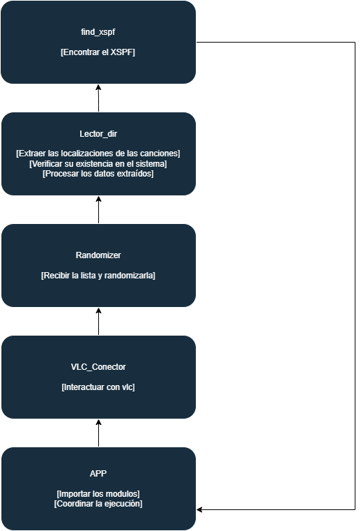

# Proyecto_Diciembre Víctor Sánchez Nogueira 1ºDAM

## Índice

1. [Introducción](#introducción)
2. [Clockify](#clockify)
3. [Diagrama De Componentes](#diagrama-de-componentes)
4. [Arquitectura De La Aplicación](#arquitectura-de-la-aplicación)
5. [Tecnologías Utilizadas](#tecnologuías-utilizadas)
6. [Instrucciones De Instalación](#instrucciones-de-instalación)
7. [Instrucciones De Uso](#instrucciones-de-uso)
8. [Dificultades Y Mejoras](#dificultades-y-mejoras)
9. [Menciones Honorificas](#menciones-honorificas)

## Introducción

Este es un proyecto sugerido por el profesor Gelpi como tarea para evaluar el trimestre, este proyecto consiste en crear un programa, utilizando los recursos dados en clase, para que este nos busque una ruta a un fichero xspf, saque las canciones de este archivo, cree un  orden aleatorio, y se las pase a vlc para que este reproduzca las canciones existentes en un orden aleatorio.

## Clockify:
Estas son las horas que dediqué al proyecto y en qué las gasté:


No está completamente actualizada ni están todos los días de trabajo, pero esto es todo a lo que le hice recuento.


## Diagrama de componentes


- Cada modulo tiene la tarea de ser llamado por el modulo principal app y devolver una informacion a traves de unos argumentos que le da la app


## Arquitectura de la aplicación

### Componentes:
- Find_xspf:

Encuetra el fichero `XSPF`

- lector_dir:

Extrae las localizaciones de las canciones
Verifica su existencia
Procesa los datos extraídos para obtener la lista de canciones.

- randomizer:

Recibe la lista de canciones y la aleatoriza.

- vlc_conector:

Interactúa con `VLC` para reproducir las canciones.

- `app`:

Importa los cuatro módulos anteriores.
Coordina la ejecución secuencial de los módulos.

Diagrama de Arquitectura:





- Descripción:
Cada módulo tiene una tarea específica y se comunica con el siguiente módulo para pasarle los datos o resultados necesarios para la siguiente etapa del proceso.
El `Módulo Principal` (app) importa los otros módulos y los llama secuencialmente para ejecutar el flujo completo del programa.

## Tecnologuías utilizadas

- Desarrollo del Programa:
* `Python`: Lenguaje de programación principal para la lógica del programa.
* Librerías de `Python`:
+ xml.etree.ElementTree: Para analizar el archivo `XSPF` y extraer los elementos de localización.
+ random: Para la aleatorización del orden de las canciones.
+ Subprocess: Para comunicarse con `VLC` y pasarle las localizaciones de las canciones.
+ os: Para encontrar el archivo xspf y comprobar la existencia de las rutas
- Manipulación de Archivos:
* `XSPF` (XML Shareable Playlist Format): Formato de archivo utilizado para definir listas de reproducción.
- Reproducción de Música:
* `VLC`: Reproductor multimedia que puede ser controlado desde la línea de comandos.

## Instrucciones de instalación

1. Sitúate donde quieras crear la app:

```bash
$ cd C:\Users\nombredeusuario\Escritorio
```

2. Crea un directorio donde almacenar la app

```bash
$ mkdir Directorio
```

3. Sitúate en el directorio

```bash
$ cd Directorio
```
4. Instala `python`, `pip3` y `git`:

Instala `python` en este enlace si no lo tienes descargado (https://www.python.org/downloads/)

```bash
$ pip --version
```
Si lo tienes instalado sáltate el siguiente paso si no:

```bash
$ python -m pip install
```

Ahora instala `git` y comprueba que lo tienes:

```bash
$ pip install git
$ git --version
```

5. clona el proyecto en el directorio

```bash
$ git clone https://github.com/VoctorSN/Proyecto_Diciembre.git
```

6. Instala las dependencias
```bash
$ pip install -r requirements.txt
```

## Instrucciones de uso

- Primero de todo:

    Ve a vlc, selecciona la carpeta donde tienes tus canciones y exportala a donde quieras (preferentemente al directorio de PROYECTO_DICIEMBRE)

- Desde el cmd:

1. Dirigete al direcotorio `Proyecto_Diciembre`

```bash
$ cd C:\Users\nombredeusuario\Escritorio\nombredeldirectorio\PROYECTO_DICIEMBRE
```

2. Ejecuta la app con `python3`

```bash
$ python3 app.py
```

3. Puedes elegir no darle parámetros para que el programa busque los `xspf` en el directorio de `PROYECTO_DICIEMBRE` o ponerle la dirección del directorio padre de los ficheros `xspf`, además tendrás que darle la dirección del `vlc` al programa como te dice la propia app al llamarla

```bash
$ C:\Users\victo\Escritorio\Clase\PR\Proyecto_Diciembre>py app.py
Introduce la ruta del VLC, si pulsas ENTER se entiende por que esta en program Files C:/users/nombredeusuario/Program Files (x86)
Introduce el directorio donde se encuentran los xspf, si pulsas ENTER se entiende por que esta en este directorio
```

4. La app te devolverá mensajes si sale cualquier error de los recogidos y también te devolverá cuántas de las canciones del `xspf` se van a reproducir y cuántas no

```bash
No se encuentra el vlc.exe
```

- Desde tu `IDE` favorito:

1. Abre el directorio PROYECTO_DICIEMBRE desde tu `IDE`

2. Ejecuta el archivo `app.py`

3. Selecciona los parámetros

## Dificultades y mejoras

Estas son las dificultades y las mejoras que podría haber implementado al proyecto
1. `Conventional Commits`:

- Me habría gustado conocer qué son los conventional Commits y cómo se deben escribir estos commits antes de haber empezado con el proyecto

2. `Clockify`:

- Clockify es el programa de la imagen del principio; este programa sirve para hacer recuento de cuánto tiempo dedicas a hacer cualquier actividad, y aunque solo lo usé la última semana de desarrollo, sirve para que nos demos cuenta de cuánto tiempo dedicamos a qué partes del proyecto

3. `Tox`:

- Tox es un programa para, entre otras cosas, automatizar los casos de test y validar tu programa en diferentes versiones; actualmente no controlo el programa, pero si le dedicase un tiempo, estoy seguro de que implementar sus funcionalidades al proyecto habría sido beneficioso para él

4. `Branches`:

- Las branches que utilicé en este programa no fueron las adecuadas, ya que me cuesta entender su propósito

## Menciones Honorificas
- Este apartado lo dedico a personas y desarrolladores que me ayudaron en la creación del programa:
1. [dfleta](https://github.com/dfleta/kata_tdd_pytest) -katatdd -base ideas para los markers
2. `XploitU` - me ayudó con la logica y con librerias para el desarrollo de la app 
3. [makigas](https://www.youtube.com/@makigas) - Conventional commits
4. [programing5393](https://www.youtube.com/@programming5393) - requirements.txt